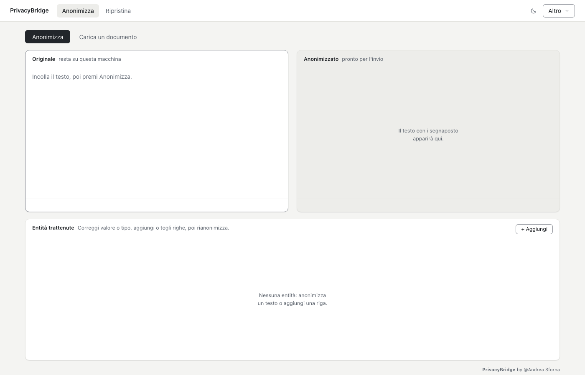
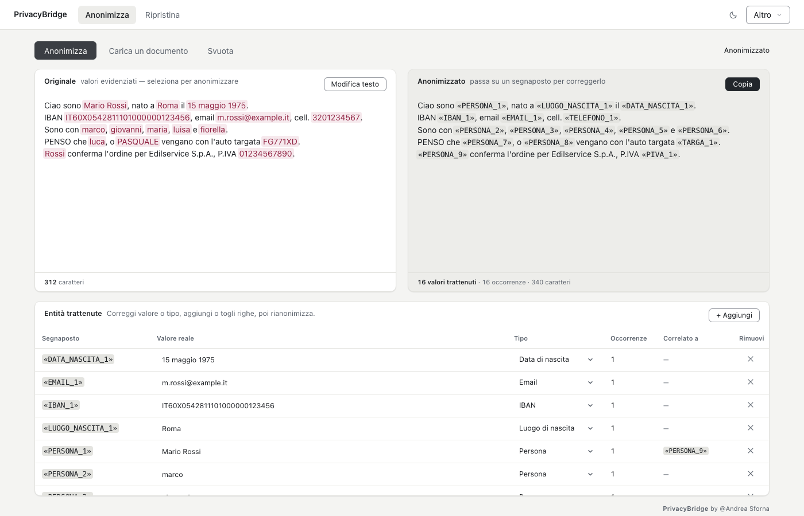
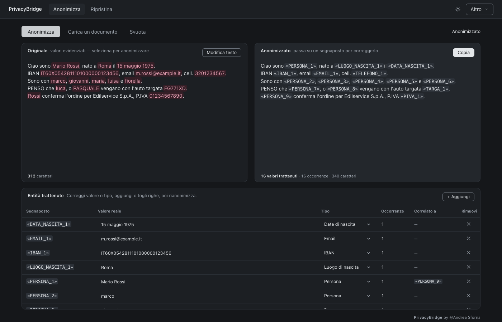

# PrivacyBridge

[](LICENSE)
[](src/avvio.py)
[](docs/MANUALE.md)
[](docs/MANUALE.md#cosa-non-fa)

**Anonimizzazione locale e reversibile di testi e documenti italiani.**
Sostituisce nomi, IBAN, codici fiscali e recapiti con segnaposto, così il testo può andare
a un assistente AI cloud — e al ritorno i valori originali vengono ripristinati **byte per byte**.
Nessun dato lascia il computer.

> «Il sig. Mario Rossi, IBAN IT60X0542811101000000123456»
> diventa «Il sig. «PERSONA_1», IBAN «IBAN_1»»

## Come funziona

1. **Anonimizza** — incolli il testo o carichi un documento, l'app sostituisce i dati sensibili.
2. **Verifica** — controlli la tabella *Entità trattenute*, correggi o aggiungi, poi **Copia**.
3. **Usa l'AI** — incolli il testo pulito in ChatGPT / Claude / Gemini e lavori normalmente.
4. **Ripristina** — incolli la risposta nella scheda *Ripristina*: i valori veri tornano al loro posto.

Non chiudere l'app tra il punto 2 e il 4: la corrispondenza etichette ↔ valori veri vive lì dentro.





*Schermate con dati di esempio fittizi (Mario Rossi, IBAN e contatti inventati).*

## Caratteristiche

- **100% locale** — nessuna telemetria, nessun cloud. L'unica connessione (facoltativa e
  disattivabile) è il controllo aggiornamenti all'avvio.
- **Reversibile esatta** — `Ripristina(Anonimizza(X)) == X`, byte per byte.
- **Italiano vero** — nomi, cognomi, comuni, codici fiscali (formula ufficiale), P.IVA
  (checksum), IBAN (mod-97), carte (Luhn), targa/VIN, atti e protocolli, email, telefoni,
  indirizzi, tessere sanitarie e documenti d'identità. Tassonomia completa in
  [docs/TASSONOMIA_PII.md](docs/TASSONOMIA_PII.md).
- **Documenti** — PDF, DOCX, TXT, MD, CSV, EML, MSG, RTF, ODT, XLSX, HTML. Le pagine
  scansionate passano per l'OCR nativo di sistema (Vision su macOS, Windows OCR su Windows).
- **Sei garanzie verificabili** — deterministico, mai corrompe il testo, zero fughe sui dati
  strutturati, ripristino esatto, segnaposto coerenti, mai silenzioso. Si verificano con
  `python tests/test_garanzie.py`.
- **Rete di sicurezza** — tabella entità prima di copiare + scansione pre-copia dei pattern
  residui con richiesta di conferma.

## Limiti dichiarati

Onestà prima di tutto — il capitolo completo con i numeri misurati è in
[docs/CONSEGNA.md](docs/CONSEGNA.md):

- **Non prende tutto.** Il riconoscimento è molto buono ma non perfetto: la tabella entità
  va sempre letta prima di copiare.
- **Scansioni (OCR).** Su PDF fotografati il rilevamento è meno affidabile — l'app avvisa
  e la tabella va controllata riga per riga.
- **Italiano.** Su altre lingue e nomi stranieri rari riconosce molto meno.
- **Vault non cifrato.** I valori veri restano in un archivio locale protetto dai permessi
  (0600), non cifrato: tenere attiva la cifratura disco (FileVault / BitLocker).

## Installazione da sorgente

```bash
python3 -m venv venv && source venv/bin/activate   # Windows: venv\Scripts\activate
pip install -r requirements.txt
python -m spacy download it_core_news_sm           # modello italiano spaCy
python src/avvio.py
```

I pesi del modello neurale PII (`rizzo-pii-0.3B`, MIT — vedi `NOTICE.txt`) vengono scaricati
al primo avvio da Hugging Face.

## Test

```bash
./verifica_tutto.sh        # suite completa (motore, documenti, garanzie, UI)
./verifica_tutto.sh --rapido
```

8 suite, 861 test. Tempi misurati su Intel i7-8750H (CPU): ~7 s per 10.000 caratteri,
~2 min per 100.000. Dettagli in [docs/MANUALE.md](docs/MANUALE.md#tempi-reali-misurati).

## Pacchetti

- **macOS** — `PrivacyBridge.dmg` (trascina in Applicazioni; prima apertura con tasto
  destro → Apri, app non firmata Apple). Ricetta in `build/build_bundle.sh` + `build/*.spec`.
- **Windows** — installer da costruire su macchina Windows reale (`docs/BLOCCHI.md` §11,
  `build/PrivacyBridge-windows.iss`). Non distribuiamo exe mai provati: in questo repo
  non ce n'è uno precompilato.

Guida utente completa: [docs/MANUALE.md](docs/MANUALE.md) · istruzioni non tecniche: `PrivacyBridge-App/LEGGIMI.txt` (fuori repo).

## Struttura

```
src/          avvio.py, api/ (FastAPI + UI), backend/ (motore, vault, OCR), data/liste/
tests/        motore, tassonomia, avversariale, documenti+OCR, garanzie, UI
benchmark/    solo codice di misura (i documenti privati restano fuori da git)
docs/         MANUALE, CONSEGNA, DECISIONI, BLOCCHI, PROGRESSO, screenshots/
scripts/      liste nomi, gate finale, screenshot, contrasti
assets/       icone + sorgenti liste   build/  ricette .spec/.sh/.iss (bundle escluso)
```

## Licenza

MIT — © 2026 Andrea Sforna. Vedi [LICENSE](LICENSE).
Terze parti (modello neurale, dizionari, spaCy, Presidio) in [NOTICE.txt](NOTICE.txt).
